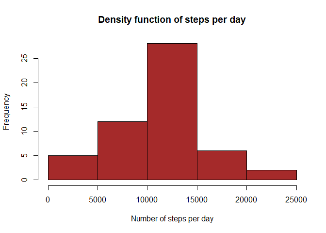
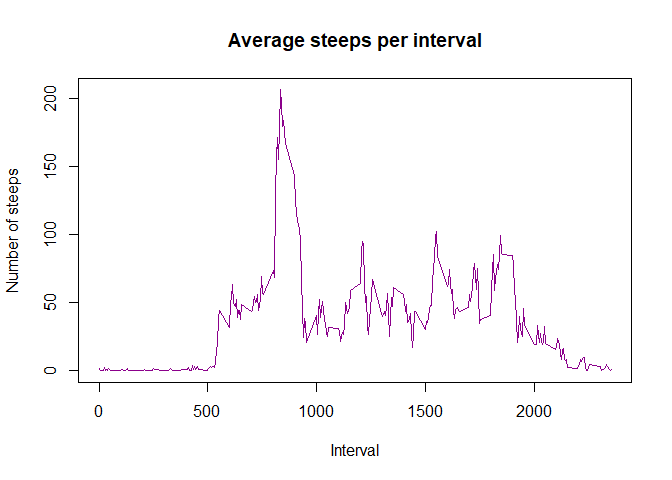
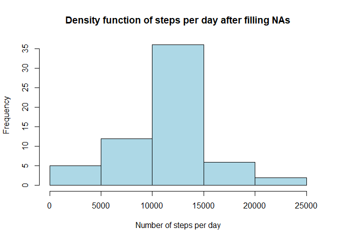

# Assessment 5_2
Pablo Alfonso García  
15 de agosto de 2017  


## Introduction

This is the R Markdown document aimed to pass the second week assessment of the Reproducible Research course by John's Hopkins University in Coursera.  

This assignment makes use of data from a personal activity monitoring device. This device collects data at 5 minute intervals through out the day. The data consists of two months of data from an anonymous individual collected during the months of October and November, 2012 and include the number of steps taken in 5 minute intervals each day.

## Objectives

In this assessment, we have to write a report that contains the following points:

1. Code for reading in the dataset and/or processing the data
2. Histogram of the total number of steps taken each day
3. Mean and median number of steps taken each day
4. Time series plot of the average number of steps taken
5. The 5-minute interval that, on average, contains the maximum number of steps
6. Code to describe and show a strategy for imputing missing data
7. Histogram of the total number of steps taken each day after missing values are imputed
8. Panel plot comparing the average number of steps taken per 5-minute interval across weekdays and weekends
9. All of the R code needed to reproduce the results (numbers, plots, etc.) in the report

## Proposed Report

### Preliminaries


```r
# Check if necessary libraries are installed or not.
list.of.packages <- "ggplot2"
new.packages <- 
      list.of.packages[!(list.of.packages %in% installed.packages()[ ,"Package"])]

if (length(new.packages))
      install.packages(new.packages)

library(ggplot2)
```

```
## Warning: package 'ggplot2' was built under R version 3.4.1
```

### 1) Code for reading in the dataset and/or processing the data


```r
# Download the file.
if (!file.exists("./Reproducible Research/Ass5_2/data")) {
      dir.create("./Reproducible Research/Ass5_2/data", recursive = TRUE)
}

file_URL <- "https://d396qusza40orc.cloudfront.net/repdata%2Fdata%2Factivity.zip"
download.file(file_URL,
              destfile = "./Reproducible Research/Ass5_2/data/data.zip",
              mode = 'wb')

# Unzip the file.
unzip(zipfile = "./Reproducible Research/Ass5_2/data/data.zip",
      exdir = "./Reproducible Research/Ass5_2/data")

# Read the data, load it into a DF.
data_PATH = "./Reproducible Research/Ass5_2/data/activity.csv"

data_DF <- read.csv(file = data_PATH)

# Clean data

clean_data_DF <- data_DF[complete.cases(data_DF), ]
```

### 2) Histogram of the total number of steps taken each day


```r
# Steps per day calculus

steps_day <- tapply(X = clean_data_DF$steps,
                    INDEX = clean_data_DF$date,
                    sum)

# Plot number of steps per day (histogram/density function)

hist(steps_day, 
     main = "Density function of steps per day",
     xlab = "Number of steps per day",
     col = "brown")
```

<!-- -->

###  3) Mean and median number of steps taken each day


```r
# Return mean and median per day

mean_steps_day <- mean(x = steps_day,na.rm = TRUE)
median_steps_day <- median(x = steps_day,na.rm = TRUE)

sprintf("La media del número de pasos por día es %s y la mediana es %s", 
        round(mean_steps_day,0),median_steps_day)
```

```
## [1] "La media del número de pasos por día es 10766 y la mediana es 10765"
```

### 4) Time series plot of the average number of steps taken


```r
# Plot average steps per interval and return the interval of the maximum.

steps_interval <- tapply(X = clean_data_DF$steps,
                          INDEX = clean_data_DF$interval,
                          FUN = mean)

plot(y = steps_interval,x = names(steps_interval),
     type = "l", col = "dark magenta", 
     main = "Average steeps per interval", 
     ylab = "Number of steeps", xlab = "Interval" )
```

<!-- -->

### 5) The 5-minute interval that, on average, contains the maximum number of steps


```r
max_value <- max(steps_interval)
max_value_pos <- names(subset(steps_interval,steps_interval == max_value))

sprintf("The higher number of steps (average) is in the interval %s",
        max_value_pos)
```

```
## [1] "The higher number of steps (average) is in the interval 835"
```

### 6) Code to describe and show a strategy for imputing missing data) Time series plot of the average number of steps taken


```r
# Return number of NAs

sprintf("Hay %i NAs.", sum(is.na(data_DF$steps)))
```

```
## [1] "Hay 2304 NAs."
```

```r
# Fill NAs using, for each lost step, the mean of steps of its interval.

data_DF_NA <- data_DF[is.na(data_DF$steps),]
days_NA <- as.vector(unique(data_DF_NA$date))

filled_data_DF <- data_DF

for (i in 1:length(filled_data_DF$date)) {
      
      if (is.na(filled_data_DF[i,1])) {
            
            interval_i <- subset(data_DF, data_DF$interval == data_DF[i,3])
            mean_steps_interval_i <- mean(interval_i[,1], na.rm = TRUE)
            
            filled_data_DF[i,1] <- mean_steps_interval_i      
      }

}
```

### 7) Histogram of the total number of steps taken each day after missing values are imputed


```r
# Plot density diagram of the total number of steps per day after filling NA data.

steps_day_filled <- tapply(X = filled_data_DF$steps,filled_data_DF$date,sum)
hist(steps_day_filled, 
     main = "Density function of steps per day after filling NAs",
     xlab = "Number of steps per day",
     col = "light blue")
```

<!-- -->

### 8) Panel plot comparing the average number of steps taken per 5-minute interval across weekdays and weekends


```r
# Classify days in weekdays and weekends


for (i in 1:length(filled_data_DF$date)) {

      day <- weekdays(as.Date(filled_data_DF[i,2]))

      filled_data_DF[i,4] <- switch(day, 
                                    lunes = "weekday",
                                    martes = "weekday",
                                    miércoles = "weekday",
                                    jueves = "weekday",
                                    viernes = "weekday",
                                    sábado = "weekend",
                                    domingo = "weekend"
                                    )
}                                   

filled_data_weekdays_DF <- filled_data_DF[filled_data_DF[,4] == "weekday",]
filled_data_weekends_DF <- filled_data_DF[filled_data_DF[,4] == "weekend",]

# Steps by type of day calculus

steps_interval_weekdays <- tapply(X = filled_data_weekdays_DF$steps,
                                  INDEX = filled_data_weekdays_DF$interval,
                                  FUN = mean)

steps_interval_weekends <- tapply(X = filled_data_weekends_DF$steps,
                                  INDEX = filled_data_weekends_DF$interval,
                                  FUN = mean)
# Plot of the comparison

opar <- par()
par(mfrow = c(2,1))
plot(x = names(steps_interval_weekdays),y = steps_interval_weekdays,
     type = "l",
     main = "Steps per interval (weekdays)",
     xlab = "Interval",ylab = "Steps ")
plot(x = names(steps_interval_weekends),y = steps_interval_weekends,
     type = "l",
     main = "Steps per interval (weekends)",
     xlab = "Interval",ylab = "Steps ")
```

-1.png)<!-- -->

### 9) All of the R code needed to reproduce the results (numbers, plots, etc.) in the report


```r
# Check if necessary libraries are installed or not.
list.of.packages <- "ggplot2"
new.packages <- 
      list.of.packages[!(list.of.packages %in% installed.packages()[ ,"Package"])]

if (length(new.packages))
      install.packages(new.packages)

library(ggplot2)

# Download the file.
if (!file.exists("./Reproducible Research/Ass5_2/data")) {
      dir.create("./Reproducible Research/Ass5_2/data", recursive = TRUE)
}

file_URL <- "https://d396qusza40orc.cloudfront.net/repdata%2Fdata%2Factivity.zip"
download.file(file_URL,
              destfile = "./Reproducible Research/Ass5_2/data/data.zip",
              mode = 'wb')

# Unzip the file.
unzip(zipfile = "./Reproducible Research/Ass5_2/data/data.zip",
      exdir = "./Reproducible Research/Ass5_2/data")

# Read the data, load it into a DF.
data_PATH = "./Reproducible Research/Ass5_2/data/activity.csv"

data_DF <- read.csv(file = data_PATH)

# Clean data

clean_data_DF <- data_DF[complete.cases(data_DF), ]

# Steps per day calculus

steps_day <- tapply(X = clean_data_DF$steps,
                    INDEX = clean_data_DF$date,
                    sum)

# Plot number of steps per day (histogram/density function)

hist(steps_day, 
     main = "Density function of steps per day",
     xlab = "Number of steps per day",
     col = "brown")

# Return mean and median per day

mean_steps_day <- mean(x = steps_day,na.rm = TRUE)
median_steps_day <- median(x = steps_day,na.rm = TRUE)

sprintf("La media del número de pasos por día es %s y la mediana es %s", 
        round(mean_steps_day,0),median_steps_day)

# Plot average steps per interval and return the interval of the maximum.

steps_interval <- tapply(X = clean_data_DF$steps,
                          INDEX = clean_data_DF$interval,
                          FUN = mean)

plot(y = steps_interval,x = names(steps_interval),
     type = "l", col = "dark magenta", 
     main = "Average steeps per interval", 
     ylab = "Number of steeps", xlab = "Interval" )

max_value <- max(steps_interval)
max_value_pos <- names(subset(steps_interval,steps_interval == max_value))

sprintf("The higher number of steps (average) is in the interval %s",
        max_value_pos)


# Return number of NAs

sprintf("Hay %i NAs.", sum(is.na(data_DF$steps)))

# Fill NAs using, for each lost step, the mean of steps of its interval.

data_DF_NA <- data_DF[is.na(data_DF$steps),]
days_NA <- as.vector(unique(data_DF_NA$date))

filled_data_DF <- data_DF

for (i in 1:length(filled_data_DF$date)) {
      
      if (is.na(filled_data_DF[i,1])) {
            
            interval_i <- subset(data_DF, data_DF$interval == data_DF[i,3])
            mean_steps_interval_i <- mean(interval_i[,1], na.rm = TRUE)
            
            filled_data_DF[i,1] <- mean_steps_interval_i      
      }

}

# Plot density diagram of the total number of steps per day after filling NA data.

steps_day_filled <- tapply(X = filled_data_DF$steps,filled_data_DF$date,sum)
hist(steps_day_filled, 
     main = "Density function of steps per day after filling NAs",
     xlab = "Number of steps per day",
     col = "light blue")

# Return mean and median per day

mean_steps_day_filled <- mean(x = steps_day_filled,na.rm = TRUE)
median_steps_day_filled <- median(x = steps_day_filled,na.rm = TRUE)

sprintf("The average number of steps per day is %s and the median is %s", 
        round(mean_steps_day_filled,0),median_steps_day_filled)

# Classify days in weekdays and weekends


for (i in 1:length(filled_data_DF$date)) {

      day <- weekdays(as.Date(filled_data_DF[i,2]))

      filled_data_DF[i,4] <- switch(day, 
                                    lunes = "weekday",
                                    martes = "weekday",
                                    miércoles = "weekday",
                                    jueves = "weekday",
                                    viernes = "weekday",
                                    sábado = "weekend",
                                    domingo = "weekend"
                                    )
}                                   

filled_data_weekdays_DF <- filled_data_DF[filled_data_DF[,4] == "weekday",]
filled_data_weekends_DF <- filled_data_DF[filled_data_DF[,4] == "weekend",]

# Steps by type of day calculus

steps_interval_weekdays <- tapply(X = filled_data_weekdays_DF$steps,
                                  INDEX = filled_data_weekdays_DF$interval,
                                  FUN = mean)

steps_interval_weekends <- tapply(X = filled_data_weekends_DF$steps,
                                  INDEX = filled_data_weekends_DF$interval,
                                  FUN = mean)
# Plot of the comparison

opar <- par()
par(mfrow = c(2,1))
plot(x = names(steps_interval_weekdays),y = steps_interval_weekdays,
     type = "l",
     main = "Steps per interval (weekdays)",
     xlab = "Interval",ylab = "Steps ")
plot(x = names(steps_interval_weekends),y = steps_interval_weekends,
     type = "l",
     main = "Steps per interval (weekends)",
     xlab = "Interval",ylab = "Steps ")
```
